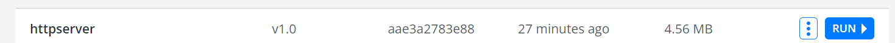
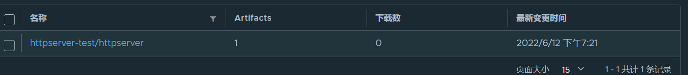

# Model-2 作业

## 要求：

    编写一个HTTP服务器

* 接收客户端的request，并将request中带的header写入response header
* 读取当前系统的环境变量中的VERSION配置，并写入response header
* Server端记录访问日志包括客户端IP，HTTP返回码，输出到server端的标准输出
* 当访问localhost/healthz时，应返回200

# Model-3

## 要求

* 构建本地镜像
* 编写 Dockerfile 将练习 2.2 编写的 httpserver 容器化
* 将镜像推送至 docker 官方镜像仓库
* 通过 docker 命令本地启动 httpserver
* 通过 nsenter 进入容器查看 IP 配置

docker build -t httpserver:v1.0 .

私有仓库推送

docker tag httpserver:v1.0 harbor.iluvatar.com:1080/httpserver-test/httpserver:v1.0

docker login harbor.iluvatar.com:1080

docker push harbor.iluvatar.com:1080/httpserver-test/httpserver:v1.0

# Model-8 
    现在你对 Kubernetes 的控制面板的工作机制是否有了深入的了解呢？
    是否对如何构建一个优雅的云上应用有了深刻的认识，那么接下来用最近学过的知识把你之前编写的 http 以优雅的方式部署起来吧，你可能需要审视之前代码是否能满足优雅上云的需求。
    作业要求：编写 Kubernetes 部署脚本将 httpserver 部署到 Kubernetes 集群，以下是你可以思考的维度。

* 优雅启动
* 优雅终止
* 资源需求和 QoS 保证
* 探活
* 日常运维需求，日志等级
* 配置和代码分离

答案
   增加了deploy目录，yaml文件在该目录中

# Model-10
   1.为 HTTPServer 添加 0-2 秒的随机延时；
   2.为 HTTPServer 项目添加延时 Metric；
   3.将 HTTPServer 部署至测试集群，并完成 Prometheus 配置；
   4.从 Promethus 界面中查询延时指标数据；
   5.（可选）创建一个 Grafana Dashboard 展现延时分配情况。
